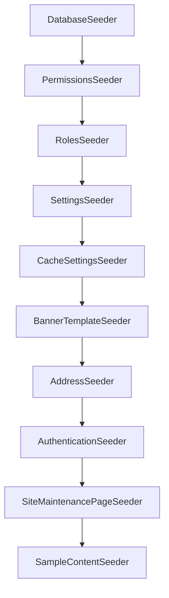

# Database Seeding

This document describes what `php artisan migrate --seed` creates on a **new install**.
Seeders are idempotent where possible (`updateOrCreate`) so re-running is safe on empty or partially seeded databases.

For quick start commands, see [../README.md](../README.md).

## Overview

Seeding is split into two groups:

| Group | Purpose | Seeder |
|-------|---------|--------|
| Framework essentials | RBAC, settings, templates, reference data, admin account | See [Essential seeders](#essential-seeders) |
| Sample content | Starter pages, articles, banners, and menus for new projects | [`SampleContentSeeder`](../database/seeders/SampleContentSeeder.php) |

`DatabaseSeeder` runs essentials first, then sample content.



Additionally, the content-types migration inserts `page` and `article` rows from [`config/content-types.php`](../config/content-types.php).

## Commands

```bash
php artisan migrate --seed              # Migrate + seed (new installs)
php artisan migrate:fresh --seed        # Drop all tables, migrate, seed
php artisan db:seed                     # Seed only (requires migrated schema)
php artisan db:seed --class=Database\\Seeders\\SampleContentSeeder  # Sample content only
```

**Warning:** `SampleContentSeeder` uses fixed slugs and banner keys. Running it on a database with real content can overwrite entries that share those keys (e.g. `about`, `services`, `sample-hero_center`).

## Essential seeders

### PermissionsSeeder

**File:** [`app/Modules/Permissions/Seeders/PermissionsSeeder.php`](../app/Modules/Permissions/Seeders/PermissionsSeeder.php)

| Table | Rows | Notes |
|-------|------|-------|
| `permissions` | ~60+ | One row per module action from `ModuleRegistry` |

### RolesSeeder

**File:** [`app/Modules/Roles/Seeders/RolesSeeder.php`](../app/Modules/Roles/Seeders/RolesSeeder.php)

| Table | Rows | Notes |
|-------|------|-------|
| `roles` | 5 | `super_administrator`, `administrator`, `editor`, `author`, `viewer` |
| `permission_role` | many | Role-to-permission mappings |

### SettingsSeeder

**File:** [`app/Modules/Settings/Database/Seeders/SettingsSeeder.php`](../app/Modules/Settings/Database/Seeders/SettingsSeeder.php)

| Group | Keys |
|-------|------|
| `general` | website_name, tagline, site_logo_id, favicon_id, maintenance_mode, maintenance_page_url |
| `email` | mail_driver, smtp_*, from_address, from_name |
| `contact` | email, phone, address |
| `auth` | registration_enabled, password rules, login_max_attempts, session_lifetime |
| `media` | disk, storage_provider, max_upload_kb, allowed_mime_types, default_view |
| `seo` | sitemap_enabled, homepage_*, default_changefreq_*, default_priority |

Default branding uses **"Your Website"** — neutral placeholders for downstream projects.

### CacheSettingsSeeder

**File:** [`app/Modules/Cache/Database/Seeders/CacheSettingsSeeder.php`](../app/Modules/Cache/Database/Seeders/CacheSettingsSeeder.php)

| Group | Keys |
|-------|------|
| `cache` | enabled, ttl_days |

### BannerTemplateSeeder

**File:** [`app/Modules/Banners/Database/Seeders/BannerTemplateSeeder.php`](../app/Modules/Banners/Database/Seeders/BannerTemplateSeeder.php)

| Table | Rows | Notes |
|-------|------|-------|
| `banner_templates` | 12 | System layout definitions (not visible content) |

Templates: `hero_center`, `hero_left`, `hero_right`, `image_carousel`, `split_layout`, `video_hero`, `minimal`, `image_left`, `image_right`, `two_column_full_width`, `three_column_full_width`, `inner_page`.

Also removes deprecated template keys and reassigns any banners using them.

### AddressSeeder

**File:** [`app/Modules/Address/Database/Seeders/AddressSeeder.php`](../app/Modules/Address/Database/Seeders/AddressSeeder.php)

| Table | Rows | Source |
|-------|------|--------|
| `provinces` | ~84 | [`provinces.json`](../app/Modules/Address/Database/data/provinces.json) |
| `cities` | ~1,634 | [`locations-flat.json`](../app/Modules/Address/Database/data/locations-flat.json) |

Philippines reference data. Skips gracefully if JSON files are missing.

### AuthenticationSeeder

**File:** [`app/Modules/Authentication/Seeders/AuthenticationSeeder.php`](../app/Modules/Authentication/Seeders/AuthenticationSeeder.php)

| Table | Rows | Notes |
|-------|------|-------|
| `users` | 1 | `admin@fyd.local` / password: `password` |
| `role_user` | 1 | Assigned `super_administrator` role |

Change the admin password immediately after first login in production.

### SiteMaintenancePageSeeder

**File:** [`app/Modules/Content/Database/Seeders/SiteMaintenancePageSeeder.php`](../app/Modules/Content/Database/Seeders/SiteMaintenancePageSeeder.php)

| Table | Rows | Notes |
|-------|------|-------|
| `contents` | 1 | slug: `site-maintenance`, type: `page`, published |
| `seo_meta` | 1 | SEO for maintenance page |

Required because `general.maintenance_page_url` defaults to `/site-maintenance`.

## Sample content seeder

**File:** [`database/seeders/SampleContentSeeder.php`](../database/seeders/SampleContentSeeder.php)

Requires `AuthenticationSeeder` to have run first (`admin@fyd.local` must exist).

### Pages

| Slug | Title |
|------|-------|
| `about` | About Us |
| `services` | Services |
| `contact` | Contact |
| `privacy-policy` | Privacy Policy |
| `terms-of-service` | Terms of Service |

All pages are published with generic **"Your Website"** copy and SEO metadata.

### Articles

| Slug | Title |
|------|-------|
| `welcome-to-your-website` | Welcome to Your Website |
| `5-tips-for-better-website-content` | 5 Tips for Better Website Content |
| `why-bootstrap-for-corporate-websites` | Why Bootstrap for Corporate Websites |
| `getting-started-with-the-cms` | Getting Started with the CMS |

### Banners

One published sample banner per template, keyed `sample-{template_key}`:

| Key | Template |
|-----|----------|
| `sample-hero_center` | Hero Center |
| `sample-hero_left` | Hero Left |
| `sample-hero_right` | Hero Right |
| `sample-image_carousel` | Image Carousel |
| `sample-split_layout` | Split Layout |
| `sample-video_hero` | Video Hero |
| `sample-minimal` | Minimal |
| `sample-image_left` | Image Left |
| `sample-image_right` | Image Right |
| `sample-two_column_full_width` | Two-Column Full Width |
| `sample-three_column_full_width` | Three-Column Full Width |
| `sample-inner_page` | Inner Page Banner |

Structure is built from each template's schema via `BannerService::syncStructure()`. Carousel templates receive two slides; column templates fill each column block.

Reference banners in themes by key. See [BANNER_MODULE.md](BANNER_MODULE.md).

### Menus

| Location | Items |
|----------|-------|
| Header | Home, About, Services, Contact |
| Footer | About, Services, Contact, Privacy Policy, Terms of Service |

## Migration-seeded data

Not a seeder class — inserted during migrate:

| Table | Rows | Source |
|-------|------|--------|
| `content_types` | 2 | `page`, `article` from [`config/content-types.php`](../config/content-types.php) |

## Tables not seeded

These exist after migrate but start empty:

- `media`, `media_folders`, `media_tags`, and related media tables
- `audit_logs`
- `banner_placements`
- `sessions` (runtime)

## Expected row counts

| Table | Approx. rows |
|-------|-------------|
| `permissions` | ~60+ |
| `roles` | 5 |
| `settings` | ~35 |
| `banner_templates` | 12 |
| `provinces` | ~84 |
| `cities` | ~1,634 |
| `users` | 1 |
| `content_types` | 2 |
| `contents` | 10 (5 pages + 4 articles + 1 maintenance) |
| `seo_meta` | 10 |
| `banners` | 12 |
| `menus` | 2 |
| `menu_items` | 9 |

## Customizing for downstream projects

1. **Branding** — Update `SettingsSeeder` defaults or change values in Admin → Settings after seed.
2. **Sample content** — Edit [`SampleContentSeeder.php`](../database/seeders/SampleContentSeeder.php) or replace it with project-specific seeders.
3. **Skip sample content** — Remove `SampleContentSeeder` from [`DatabaseSeeder.php`](../database/seeders/DatabaseSeeder.php) for bare installs.
4. **Address data** — Replace JSON files in `app/Modules/Address/Database/data/` or remove `AddressSeeder` if the Address module is disabled.
5. **Admin account** — Change email/password in `AuthenticationSeeder` before first deploy.

## Tests

[`tests/Feature/SampleContentSeederTest.php`](../tests/Feature/SampleContentSeederTest.php) verifies seed output and public route accessibility. Run with:

```bash
php artisan test --filter=SampleContentSeederTest
```
