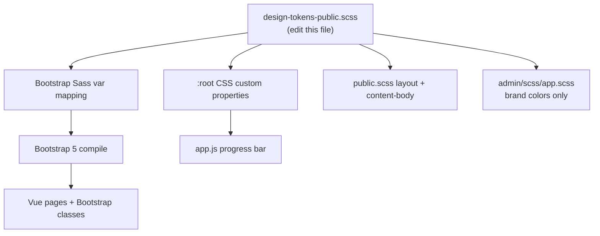

# FYD CMS — Manual Theme Guide

> **Cursor / AI agents:** Read this document before any styling, branding, color,
> font, or typography task. Follow the rules in [Agent instructions](#agent-instructions-cursor--ai) below.

## Overview

FYD CMS uses **manual, static Bootstrap + Sass themes** — not a Theme Manager
module or swappable theme system. This is intentional: the setup is simple, and
a dynamic theme framework is **deferred** until there is a concrete need.

The roadmap item **"Theme System"** in [ROADMAP.md](ROADMAP.md) refers to this
MVP styling foundation, not a pluggable theme module.

| Portal | Stack | Style entry point |
|--------|-------|-------------------|
| Admin | Blade + Bootstrap 5 | `resources/admin/scss/app.scss` |
| Public | Vue 3 + Inertia.js + Bootstrap 5 | `resources/scss/public.scss` |

Vite compiles both bundles via [vite.config.js](../vite.config.js).

[`config/fyd.php`](../config/fyd.php) defines `public.theme => fyd-default`. This
key is a **placeholder** — nothing in the codebase reads it.

---

## Quick start — retheme the public site

**Edit one file:** [`resources/scss/_design-tokens-public.scss`](../resources/scss/_design-tokens-public.scss)

Change fonts, heading sizes, body text, primary color, and surfaces there, then:

```bash
npm run dev    # or npm run build
```

Tokens flow into:

- Bootstrap Sass variables (`$primary`, `$h1-font-size`, `$font-family-sans-serif`, etc.)
- CSS custom properties on `:root` (`--fyd-color-primary`, `--fyd-font-size-h1`, etc.)
- Public layout classes (`.public-hero`, `.public-footer`, `.public-section-alt`)
- `.content-body` typography for page and blog content

Admin **brand color** and **sidebar dark surface** also read from the same token
file. Admin typography stays Bootstrap defaults (compact dashboard).



---

## Design tokens reference

All tokens live in [`resources/scss/_design-tokens-public.scss`](../resources/scss/_design-tokens-public.scss).

### Brand colors (shared with admin)

| Token | Default | Purpose |
|-------|---------|---------|
| `$fyd-color-primary` | `#2563eb` | Links, buttons, accents |
| `$fyd-color-primary-dark` | `#1d4ed8` | Link hover states |
| `$fyd-color-dark` | `#1e293b` | Hero, footer, admin sidebar |
| `$fyd-color-dark-mid` | `#334155` | Gradient stops |
| `$fyd-color-dark-light` | `#475569` | Gradient stops |
| `$fyd-color-text` | `#0f172a` | Body text |
| `$fyd-color-text-muted` | `#64748b` | Lead, meta, blockquotes |
| `$fyd-color-bg` | `#ffffff` | Page background |
| `$fyd-color-bg-alt` | `#f8fafc` | Alt sections |
| `$fyd-color-border` | `#e2e8f0` | Dividers |

### Typography (public portal only)

| Token | Default | Purpose |
|-------|---------|---------|
| `$fyd-font-heading` | system-ui stack | h1–h6, display headings |
| `$fyd-font-body` | system-ui stack | p, div, body |
| `$fyd-font-size-body` | `1rem` | Base / paragraph |
| `$fyd-font-size-lead` | `1.25rem` | `.lead` summaries |
| `$fyd-font-size-h1` | `2.5rem` | Page titles |
| `$fyd-font-size-h2` | `2rem` | Section headings |
| `$fyd-font-size-h3` | `1.75rem` | Subsections |
| `$fyd-font-size-h4` | `1.5rem` | |
| `$fyd-font-size-h5` | `1.25rem` | |
| `$fyd-font-size-h6` | `1rem` | |
| `$fyd-line-height-body` | `1.6` | Paragraph readability |
| `$fyd-line-height-heading` | `1.2` | Headings |

These map to Bootstrap before compile, so existing classes like `display-5`,
`text-primary`, `lead`, and `btn-primary` pick up token values automatically.

### Layout (public portal only)

| Token | Default | Purpose |
|-------|---------|---------|
| `$fyd-section-padding-y` | `4rem` | `.public-section` |
| `$fyd-hero-padding-y` | `6rem` | `.public-hero` |

### CSS custom properties

After Bootstrap `:root`, [`resources/scss/_tokens-root-public.scss`](../resources/scss/_tokens-root-public.scss) emits matching `--fyd-*` variables for JavaScript and future Vue scoped styles.

---

## Content typography — `.content-body`

Rich text and plain content inside `.content-body` inherit token-driven h1–h6,
p, div, link, list, and blockquote styles.

Used in:

- [resources/js/Pages/Content/Show.vue](../resources/js/Pages/Content/Show.vue)
- [resources/js/Components/BannerRenderer.vue](../resources/js/Components/BannerRenderer.vue) (banner rich text)

When HTML content is rendered via `v-html`, wrap it in `.content-body`.

---

## Admin theme

Admin imports tokens for **brand color only**:

| File | What to change |
|------|----------------|
| [`resources/scss/_design-tokens-public.scss`](../resources/scss/_design-tokens-public.scss) | `$fyd-color-primary`, `$fyd-color-dark` (sidebar) |
| [`resources/admin/scss/app.scss`](../resources/admin/scss/app.scss) | Layout chrome, module-specific admin UI, auth gradient |
| [`resources/views/admin/layouts/`](../resources/views/admin/layouts/) | Blade layout classes |
| [`resources/views/components/admin/`](../resources/views/components/admin/) | Shared admin components |

**Admin typography** is not tokenized — edit `admin/scss/app.scss` directly if
you need compact dashboard heading sizes.

---

## Public theme — beyond tokens

For layout or component changes not covered by tokens:

| File | What to change |
|------|----------------|
| [`resources/scss/public.scss`](../resources/scss/public.scss) | Layout classes after token import |
| [`resources/js/Layouts/PublicLayout.vue`](../resources/js/Layouts/PublicLayout.vue) | Navbar structure/classes |
| [`resources/js/Components/`](../resources/js/Components/) | Component-level Bootstrap classes |
| [`resources/js/Pages/`](../resources/js/Pages/) | Page-specific layout |

**Rule:** Global public look → tokens + `public.scss`. One-off component styling
→ Vue Bootstrap classes or scoped styles.

---

## Build and verify

```bash
npm run dev    # or npm run build
```

Spot-check after changing tokens:

- **Public:** home hero, section h2s, footer, content `.content-body`
- **Public:** primary buttons/links (`text-primary`, `btn-primary`)
- **Public:** Inertia progress bar matches `$fyd-color-primary`
- **Admin:** sidebar active border and primary accents match tokens

If a color looks wrong after a token change, grep the repo for hardcoded hex
values as a fallback — most should now flow from tokens.

---

## What is NOT themed (by design)

- No dark/light mode toggle
- No admin appearance settings UI
- No `themes/` folder or theme registry
- Page sections / content components are hardcoded in Vue — not theme-driven
- **Theme Manager** (listed in [ARCHITECTURE.md](ARCHITECTURE.md) and
  [FRAMEWORK.md](FRAMEWORK.md)) is a **future** framework service

---

## When to revisit

Consider a Theme Manager module only if you need:

- Multiple swappable client themes
- Admin-editable design tokens
- Per-theme Vue component resolution

Until then, edit [`resources/scss/_design-tokens-public.scss`](../resources/scss/_design-tokens-public.scss) first.
